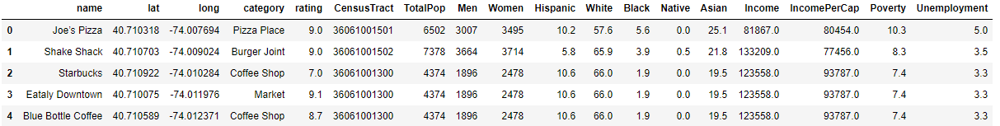
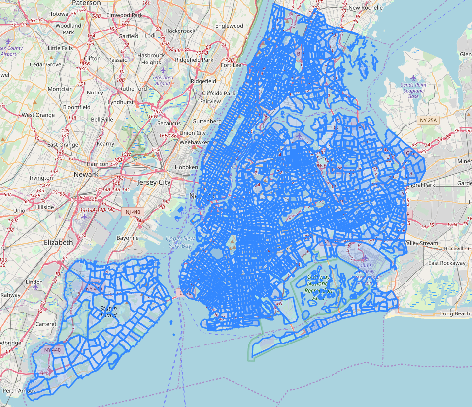
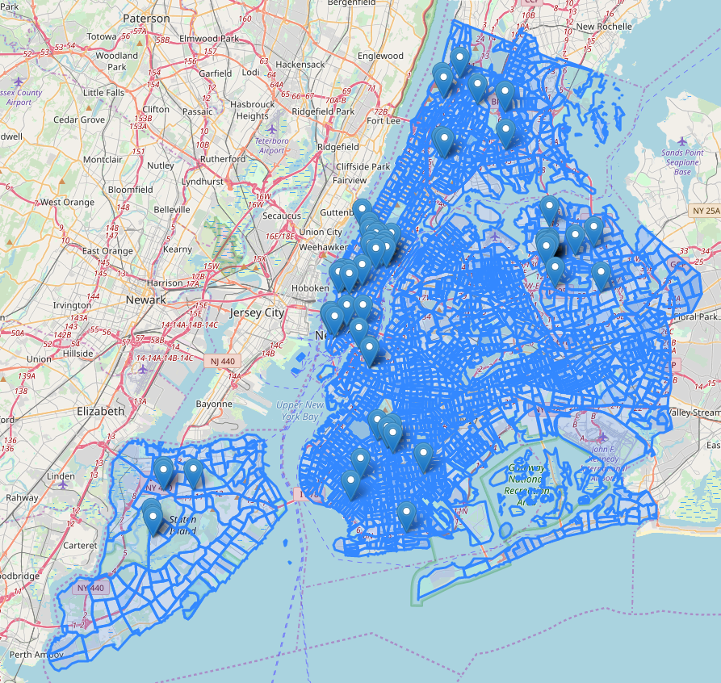
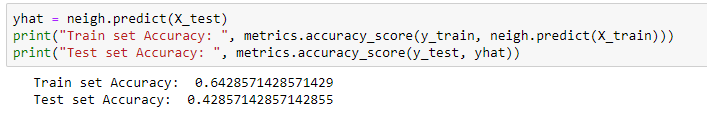

# data-science
<h1> Exploring relationships between NYC food outlets and local demographics </h1>
<em> blog post is created as part of the Coursera Data Science Capstone project</em>
 
<h2> Introduction </h2>

New York City is ranked as one of the most diverse cities in the world, featuring a wide variety of people, cultures and language. It is also one of the most populous, with 8.6 million people crammed into a 783.8 km squared space. This rich diversity and high population density mean that the demographics of the population can vary heavily not only between boroughs or suburbs but even street to street. 
  
Food outlets are in abundance in New York, with the popularity and incidence of different food venue types likely having a close relationship with the demographics of the localised population. Understanding how the demographic of an area affect the success of venues and having the ability to select the most suitable food venue for an area can be advantageous for developers and future business owners.
 
 In this analysis, I explore the relationship between **high rated food venues** and the **demographic of their local area**.

<h2>Data</h2>

The data used is from 3 sources:
   
  <ol>
   <li> <b>Foursquare Location Data</b> - Venue Name, Location, Category, Rating</li>
   <li> <b>NYC 2010 Census Data</b> - 20+ attributes such as sex, race, income grouped by Census Tract</li>
    <li> <b>NYC Geo Data</b> - GeoJSON w/ Census tract boundaries</li>
  </ol>
 

 <h2>Methodology</h2>
 <h3>Data Preparation</h3>

 To begin with, I loaded NYC Geo Data and NYC 2010 Census data into my notebook from storage.  
  Using the Foursquare places API, I retrieved the data for ~300 food venues. 
 I then used the Shapely python library to convert the GeoJSON into polygons which could then be compared with the venue data to assign each a Census Tract code.  
  The data was then combined into this dataframe and cleaned.  
  
   
  From here, because classification models can struggle with a lot of classifications, I decided to use only the top five venues - 
  <ol><li>Coffee Shop</li> 
  <li>American Restaurant</li> 
  <li>Asian Restaurant</li> 
  <li>Food Court</li>  
  <li>Fast Food Restaraunt</li>
  </ol>
  For this analysis, I'm only looking to understand successful or highly rated food venues. In this case, I define success as having a <b>Rating greater than 7 out of 10, so I cut out any that don't fit this criteria</b>  
  

<h3>Exploratory Analysis</h3>

 The map below gives an idea of the size and number of census tracts. 
     
  Here's the same map with the highly rated venues overlayed.
     
  As you can see, the sample of venues is reasonably well dispersed NYC - so this analysis should give a fairly accurate picture of NYC as a whole. If the API allowed for more free calls this data could be improved.

  The following box plots show key the income and race of the population in the area for high rated venues in each category.
   
  <figure>
  <figcaption>
   Categories of High Rated Venues with Income per Capita of local area
 </figcaption>
   </figure>
    
   
  <figure>
  <figcaption>
   Categories of high rated venues with Asian Population of Local Area
 </figcaption>
   </figure> 
   
  <figure>
  <figcaption>
   Categories of High Rated Venues with Black Population of Local Area
 </figcaption>
   </figure>
   
  <figure>
  <figcaption>
   Categories of High Rated Venues with White Population of Local Area
 </figcaption>
   </figure>
   
  A few key points to take from these plots:
  <ul>
    <li> The majority of successful Asian restaurants can be found in census tract areas with relatively high Asian populations</li>
    <li> You are less likely to find a successful Coffee shop or American restaurant in areas of high Asian concentration. </li>
    <li> High rated American restaurants are found predominantly in areas with a high white population.</li>
    <li> In high income areas there is a fairly even spread of each category, however there aren’t many highly rated Asian restaurants in high income areas</li>
  </ul>

 
<h3> Machine Learning </h3>

 The classification model I chose for this analysis was the supervised method K-Nearest Neighbours for it's simplicity and general applicability. Prior to fitting the model, I reduced the data to feature only race and income per capita.
  To determine the optimal k number of neighbours, I fit the model with k=1 through k=10 and determined 7 was the most optimal.
  The accuracy of the model is shown below:
  
  
<h2>Insights</h2>

The analysis reiterates the close connection different cultures have with their food, with the race of a small areas having a predictable relationship with the food outlets that were successful there. Particularly, Asian communities were shown to host the majority of successful Asian restaurants from the sample. The relationship between demographic and successful food venues was reiterated by a 42% accurate predictive model, which could be used to recommend a food outlet to developers looking to invest in an area.

